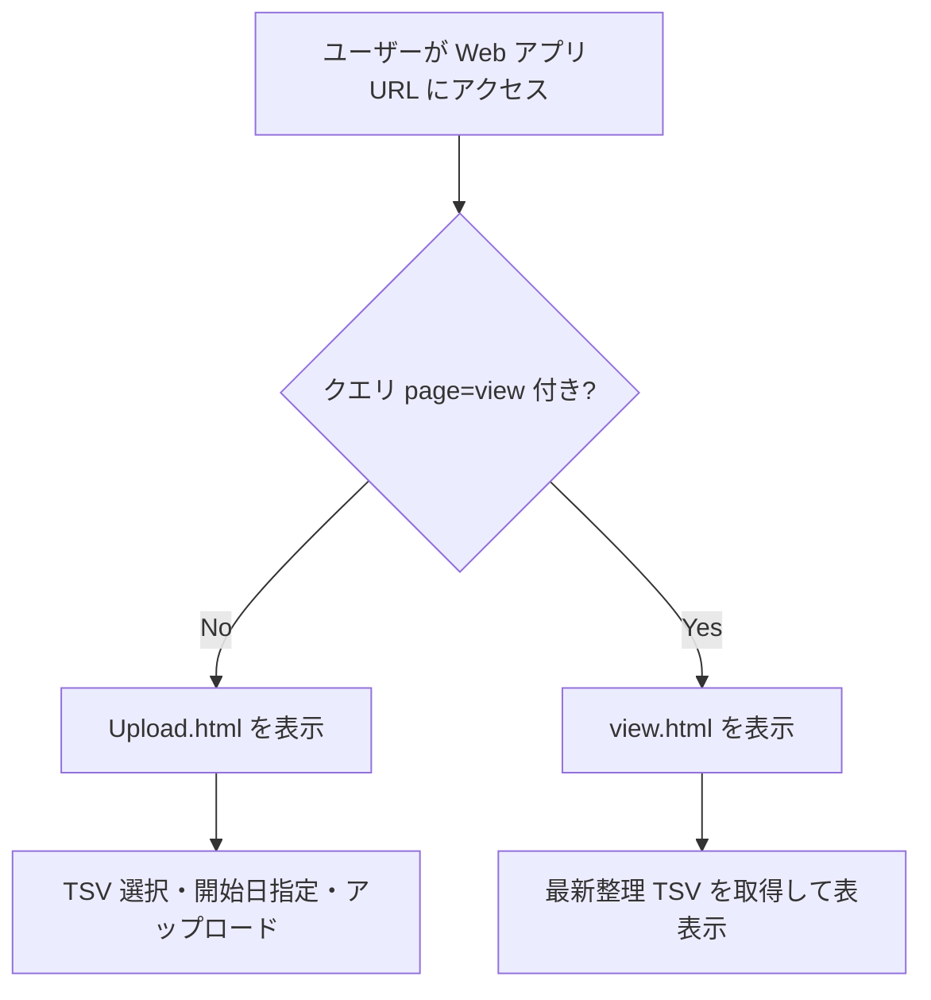
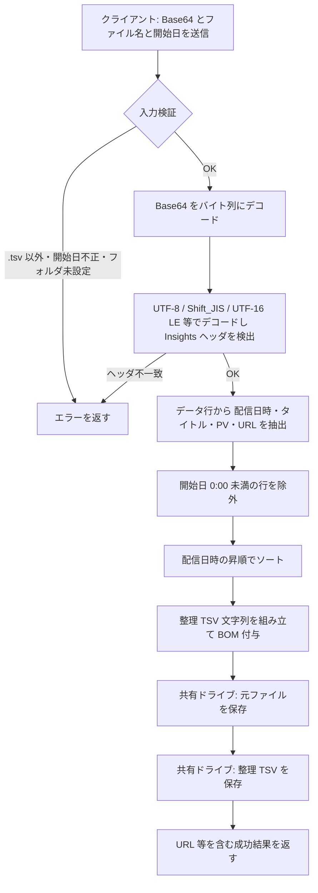
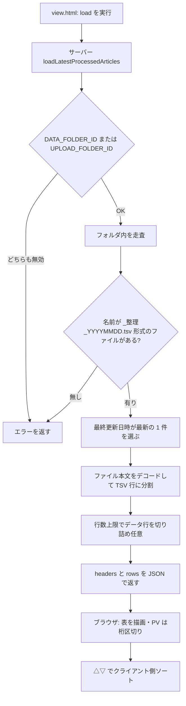

# Yahoo!ニュース Insights 記事一覧 — アップロード・整理・閲覧（GAS）

Google Apps Script（GAS）の Web アプリとして、Yahoo!ニュース Insights からエクスポートした**記事一覧 TSV**をアップロードし、共有ドライブ上に**元ファイル**と**整理済み TSV**を保存します。別 URL では**整理データの閲覧**（最新ファイルの表形式表示）ができます。

## 処理の流れ（フローチャート）

GitHub や VS Code の Markdown プレビュー、および Mermaid に対応したビューアで図が表示されます。

### 全体：画面の出し分け

### アップロード〜ドライブ保存（サーバー `saveUploadedTsv`）

### 閲覧：最新ファイルの取得〜表示

## 構成ファイル

| ファイル | 説明 |
|-----------|------|
| `Code.gs` | `doGet`、アップロード処理、TSV 解析・整理、閲覧用データ取得 |
| `Upload.html` | アップロード画面（日付指定・1 ファイルのみ） |
| `view.html` | 閲覧画面（`?page=view`） |
| `appsscript.json` | タイムゾーン `Asia/Tokyo`、V8 など（clasp 利用時） |

Apps Script エディタでは、HTML のファイル名は拡張子なしで参照されます（例: `view` → `view.html` の内容）。

## スクリプトプロパティ

プロジェクトの設定 → **スクリプトのプロパティ**で登録します。

| キー | 必須 | 説明 |
|------|------|------|
| `UPLOAD_FOLDER_ID` | はい | アップロードした**元 TSV**および**整理済み TSV**の保存先フォルダ ID（共有ドライブ内可） |
| `DATA_FOLDER_ID` | いいえ | **閲覧画面**が参照する「データ置き場」フォルダ ID。未設定のときは `UPLOAD_FOLDER_ID` と同じフォルダを参照 |

フォルダ ID は、Google ドライブでフォルダを開いた URL の `folders/` の後ろの文字列です。

## デプロイ手順

1. [Google Apps Script](https://script.google.com) でプロジェクトを作成する。
2. 上記ファイルの内容をコピーする（HTML は種類「HTML」で追加し、名前を `Upload` / `view` にする）。
3. スクリプトプロパティに `UPLOAD_FOLDER_ID`（必要なら `DATA_FOLDER_ID`）を設定する。
4. **デプロイ** → **新しいデプロイ** → 種類「**Web アプリ**」  
   - **次のユーザーとして実行**: 自分  
   - **アクセスできるユーザー**: 運用に合わせて選択（例: 組織内のみ）  
5. 発行された **Web アプリの URL** を関係者に共有する。

閲覧画面の URL は、ベース URL の末尾に `?page=view` を付けます。  
例: `https://script.google.com/macros/s/…/exec?page=view`

## アップロード画面（既定）

- **1 ファイルずつ** `.tsv` のみ（複数選択・複数ドロップは不可）。
- **配信日の開始日**（`YYYY-MM-DD`）を選ぶと、その日の 0:00 **以降**の行だけが整理 TSV に含まれる（当日を含む）。**元 TSV はフィルタせず**そのまま保存。
- 文字コードは **UTF-8 / Shift_JIS / UTF-16 LE**（メモ帳の「Unicode」）を自動判定。
- Insights のヘッダーに **`記事タイトル` / `URL` / `配信日時` / `合計(PV数)`**（または全角括弧の PV 列名）が必要。

### 出力ファイル

- **元ファイル**: アップロード時のファイル名のまま。
- **整理 TSV**: `元の名前_整理_YYYYMMDD.tsv`（`YYYYMMDD` は選択した開始日）。列は  
  `配信日時` / `記事タイトル` / `合計PV数` / `URL`（タブ区切り、UTF-8 BOM 付き）。

## 閲覧画面（`?page=view`）

- `DATA_FOLDER_ID`（未設定時は `UPLOAD_FOLDER_ID`）内で、ファイル名が **`*_整理_YYYYMMDD.tsv`** に一致するもののうち、**最終更新が最新**の 1 件を読み込み表示。
- **配信日時**・**記事タイトル**（URL があればリンク）・**合計PV数**（3 桁区切り表示）を表で表示。
- **△（昇順） / ▽（降順）** ボタンで配信日時・合計 PV のソート。
- 表領域は選択・コピーを抑止する実装あり（完全な防止ではありません）。
- 一度に返す行数の上限は `Code.gs` の `MAX_VIEW_ROWS`（既定 5000）。

## clasp を使う場合

このディレクトリを `clasp push` の対象にし、`appsscript.json` をルートに置いた構成で連携できます。

## トラブルシュート

| 現象 | 確認事項 |
|------|-----------|
| ヘッダーが見つからない | TSV が Insights 形式か、文字コードが UTF-8 / Shift_JIS / UTF-16 LE か |
| 保存・閲覧でフォルダエラー | 実行ユーザーに共有ドライブのフォルダへの編集権限があるか |
| 閲覧にデータが出ない | データ置き場に `*_整理_YYYYMMDD.tsv` があるか、`DATA_FOLDER_ID` の誤りがないか |

## ライセンス・注意

社内利用を想定したスクリプトです。Yahoo!ニュース Insights の利用規約・エクスポートデータの取り扱いは、貴社ポリシーに従ってください。
